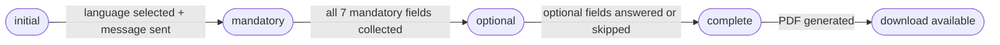

The NirbhayaSathi FIR system uses a conversational flow instead of a single-shot form. When a user posts their first message, the server extracts as many fields as possible using an LLM, then asks one-at-a-time for anything still missing. Each exchange belongs to a UUID-keyed session held in memory, so clients only need to pass `session_id` on every subsequent turn. Once all mandatory fields are collected the PDF is generated automatically and the final response carries the download URL.

<Warning>
  Sessions are stored in-process memory. A server restart clears all active sessions. Do not rely on session state surviving a deployment cycle; always cache `session_id` and `fir_number` on the client side immediately.
</Warning>

---

## POST /fir/start

Starts a new FIR session. The server enforces a per-IP rate limit and deduplicates identical messages before creating the session.

<Info>
  If `language` is omitted the server immediately returns `status: "needs_language"` and presents the language selector UI — no session is persisted until the language is confirmed via a follow-up `/fir/start` call with `language` set.
</Info>

### Rate limiting and duplicate detection

- **Rate limit:** 2 FIR sessions per IP address per calendar day. Exceeding the limit returns `HTTP 429`.
- **Duplicate detection:** If the same IP sends an identical complaint message (matched by MD5 hash) within 30 minutes, the request returns `HTTP 409`. The window resets automatically; no manual action is needed.

### Request body

<ParamField body="message" type="string">
  The user's first free-text complaint description. The LLM extracts every recognisable field (date, time, train number, crime type, etc.) from this message and pre-fills the session. If omitted the bot asks the user to describe the incident before collecting individual fields.
</ParamField>

<ParamField body="language" type="string">
  Session language. Accepted values: `en` (English), `hi` (Hindi), `bn` (Bengali). If omitted or invalid the response has `status: "needs_language"` and `options` contains the language picker list. The language selection is permanent for the lifetime of the session.
</ParamField>

<ParamField body="complainant" type="string | object">
  Pre-fill complainant details so the bot can skip those questions. Accepts either a plain string (treated as `complainant_name`) or an object with any combination of the following keys:

  | Key | Maps to |
  |-----|---------|
  | `name` / `full_name` / `complainant_name` | `complainant_name` |
  | `age` / `complainant_age` | `complainant_age` |
  | `gender` / `complainant_gender` | `complainant_gender` |
  | `phone` / `mobile` / `complainant_phone` | `complainant_phone` |
  | `address` / `complainant_address` | `complainant_address` |
  | `id` / `id_proof` / `complainant_id` | `complainant_id` |
</ParamField>

### Response — ChatResponse

<ResponseField name="session_id" type="string" required>
  UUID that identifies this conversation. Pass it as `session_id` in every subsequent `/fir/reply` request.
</ResponseField>

<ResponseField name="status" type="string" required>
  Current conversation state. Possible values:

  | Value | Meaning |
  |-------|---------|
  | `needs_language` | Language not yet selected; show language picker |
  | `awaiting_message` | Language confirmed; waiting for the first complaint description |
  | `asking` | Bot is collecting a specific field |
  | `complete` | All mandatory fields collected; PDF ready |
  | `rejected` | Message was not a railway complaint |
</ResponseField>

<ResponseField name="message" type="string" required>
  Human-readable bot message to display in the chat UI.
</ResponseField>

<ResponseField name="field" type="string">
  Key of the field currently being collected (e.g. `complainant_name`, `incident_date`). Useful for rendering specialised input widgets.
</ResponseField>

<ResponseField name="options" type="object[]">
  Selectable choices when `field` has a fixed option set. Each option has `id`, `label`, and `action_type` (`select`, `custom_input`, or `skip`).
</ResponseField>

<ResponseField name="ui_hint" type="string">
  Hint for the frontend renderer (e.g. `fullscreen_language_selector`, `chat_input_focus`).
</ResponseField>

<ResponseField name="allow_skip" type="boolean">
  When `true` the current field is optional and the user may skip it.
</ResponseField>

<ResponseField name="extracted_summary" type="object">
  Fields the LLM successfully extracted from the user's message, so the UI can show a live summary card.
</ResponseField>

<ResponseField name="fir_number" type="string">
  Only present when `status` is `complete`. The assigned FIR reference number.
</ResponseField>

<ResponseField name="download_url" type="string">
  Only present when `status` is `complete`. Relative URL of the generated PDF (e.g. `/fir/download/{session_id}`).
</ResponseField>

---

## POST /fir/reply

Continues an existing FIR conversation. The bot stores the user's answer, advances the session state, and returns the next question or the completion payload.

<Note>
  Sending a reply to an already-complete session returns `HTTP 400`. Check `status` in each response before calling `/fir/reply` again.
</Note>

### Request body

<ParamField body="session_id" type="string" required>
  The UUID returned by the `/fir/start` call. Session lookups are case-sensitive.
</ParamField>

<ParamField body="message" type="string" required>
  The user's answer to the bot's last question. For option-based fields this can be the `id` value from `options` or free text; the processor normalises both.
</ParamField>

### Response

Same `ChatResponse` schema as `/fir/start`. When `status` is `complete`:

- A PDF is generated and saved to disk at `generated_firs/fir_{session_id}.pdf`.
- `fir_number` and `download_url` are populated.
- The session's `fir_data` is persisted in-memory for the download fallback.
- A JSON copy of all FIR fields is written alongside the PDF for the police dashboard.

---

## Session state machine

The session advances through four phases in order. Once a phase is fully satisfied the session moves forward automatically — it never goes back.



| Phase | Description |
|-------|-------------|
| `initial` | Session created; language and first message not yet received |
| `mandatory` | Collecting the 7 required fields: `complainant_name`, `complainant_phone`, `incident_date`, `incident_time`, `train_number`, `incident_station`, `crime_type`, `crime_description` |
| `optional` | Collecting supplementary fields (`complainant_age`, `complainant_gender`, `complainant_address`, `coach`, `accused_description`, `witnesses`) — each can be skipped |
| `complete` | All mandatory data collected; PDF and JSON artefacts saved |

---

## Multi-step example

The example below shows a complete session from start to FIR generation.

<CodeGroup>

```bash Step 1 — start session
curl --request POST \
  --url https://api.kolkatarail.in/fir/start \
  --header 'Content-Type: application/json' \
  --data '{
    "language": "en",
    "message": "A man groped me on the Sealdah-Bandel EMU this morning around 9am"
  }'
```

```json Step 1 — response
{
  "session_id": "f3a1c2d4-e5b6-7890-abcd-ef1234567890",
  "status": "asking",
  "message": "What is your full name?",
  "field": "complainant_name",
  "options": null,
  "ui_hint": "chat_input_focus",
  "allow_skip": false,
  "extracted_summary": {
    "crime_type": "sexual_harassment",
    "incident_time": "8-12pm",
    "incident_station": "Sealdah"
  }
}
```

```bash Step 2 — reply with name
curl --request POST \
  --url https://api.kolkatarail.in/fir/reply \
  --header 'Content-Type: application/json' \
  --data '{
    "session_id": "f3a1c2d4-e5b6-7890-abcd-ef1234567890",
    "message": "Priya Sharma"
  }'
```

```json Step 2 — response
{
  "session_id": "f3a1c2d4-e5b6-7890-abcd-ef1234567890",
  "status": "asking",
  "message": "What is your contact phone number?",
  "field": "complainant_phone",
  "options": null,
  "ui_hint": "chat_input_focus",
  "allow_skip": false
}
```

```bash Step 3 — final reply (all mandatory fields now satisfied)
curl --request POST \
  --url https://api.kolkatarail.in/fir/reply \
  --header 'Content-Type: application/json' \
  --data '{
    "session_id": "f3a1c2d4-e5b6-7890-abcd-ef1234567890",
    "message": "9831012345"
  }'
```

```json Step 3 — complete response
{
  "session_id": "f3a1c2d4-e5b6-7890-abcd-ef1234567890",
  "status": "complete",
  "message": "✅ Your FIR has been generated!\n\nFIR Number: GRP/SEA/2026/00412\nCrime: sexual_harassment\nAuthority: Government Railway Police\nContact: 9836100333\n\nDownload your FIR using the link below.",
  "fir_number": "GRP/SEA/2026/00412",
  "download_url": "/fir/download/f3a1c2d4-e5b6-7890-abcd-ef1234567890"
}
```

</CodeGroup>

### Error responses

| HTTP status | Condition |
|-------------|-----------|
| `400` | Session already complete (`/fir/reply` only) |
| `404` | `session_id` not found or session expired |
| `409` | Duplicate complaint — same text from same IP within 30 minutes |
| `429` | IP has already started 2 FIR sessions today |
| `500` | PDF or JSON generation failed |
